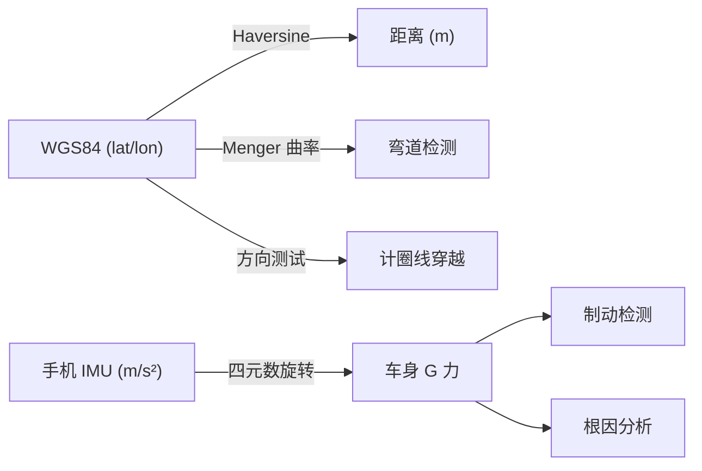

# CoDriver 坐标系与几何算法文档

本文档描述 CoDriver 引擎中使用的所有坐标系、变换方法和几何算法。

---

## 1. 坐标系总览

| 坐标系 | 用途 | 轴定义 |
|--------|------|--------|
| **WGS84** | GPS 原始输入、赛道关键点存储 | 纬度(lat, °N)、经度(lon, °E)、海拔(m) |
| **车身坐标系** | G 力分析、制动/弯道检测 | X=前方, Y=右侧, Z=上方 |
| **手机坐标系** | IMU 加速度计原始输入 | 随手机安装朝向变化 |



---

## 2. WGS84 地理坐标系

### 2.1 概述

所有 GPS 输入和赛道关键点均使用 WGS84 坐标系，以十进制度表示。

- **纬度**: 北半球为正，范围 -90° ~ +90°
- **经度**: 东半球为正，范围 -180° ~ +180°
- **海拔**: WGS84 椭球高 (m)

### 2.2 相关数据结构

```cpp
// FusedPoint 中的 WGS84 字段
struct FusedPoint {
    double latitude;     // WGS84 纬度 (°N)
    double longitude;    // WGS84 经度 (°E)
    double altitude_m;   // 海拔 (m)
    // ...
};

// TrackSegment 中的关键点
struct TrackSegment {
    double entry_lat, entry_lon;  // 弯道入口
    double apex_lat, apex_lon;    // 弯道顶点
    double exit_lat, exit_lon;    // 弯道出口
    // ...
};
```

---

## 3. Haversine 距离公式

### 3.1 公式

用于计算两个 WGS84 坐标点之间的大圆弧距离（地球表面最短距离）：

$$d = 2R \cdot \arcsin\left(\sqrt{\sin^2\frac{\Delta\varphi}{2} + \cos\varphi_1 \cos\varphi_2 \sin^2\frac{\Delta\lambda}{2}}\right)$$

其中：
- $R = 6{,}371{,}000$ m（地球平均半径）
- $\varphi$ = 纬度（弧度），$\lambda$ = 经度（弧度）
- $\Delta\varphi = \varphi_2 - \varphi_1$，$\Delta\lambda = \lambda_2 - \lambda_1$

### 3.2 实现位置

**文件**: `src/corner_detector.cpp` — `haversineMeters()` 静态函数

```cpp
static double haversineMeters(double lat1, double lon1, double lat2, double lon2) {
    constexpr double kEarthRadiusM = 6371000.0;
    constexpr double kDeg2Rad = 3.14159265358979323846 / 180.0;
    double dlat = (lat2 - lat1) * kDeg2Rad;
    double dlon = (lon2 - lon1) * kDeg2Rad;
    double a = std::sin(dlat * 0.5) * std::sin(dlat * 0.5) +
               std::cos(lat1 * kDeg2Rad) * std::cos(lat2 * kDeg2Rad) *
               std::sin(dlon * 0.5) * std::sin(dlon * 0.5);
    double c = 2.0 * std::atan2(std::sqrt(a), std::sqrt(1.0 - a));
    return kEarthRadiusM * c;
}
```

### 3.3 使用场景

| 模块 | 用途 |
|------|------|
| CornerDetector | 计算弯道入口到出口的距离，进而估算弯道角度 $\theta = \frac{d}{R} \cdot \frac{180}{\pi}$ |
| LapTimer | 逐点距离累积（使用简化公式，见 §6） |

### 3.4 注意事项

- **不要用经纬度欧几里得距离**: $d = \sqrt{(\Delta lat)^2 + (\Delta lon)^2}$ 在中高纬度地区误差巨大，因为经度1°的实际距离随纬度递减：$\approx 111.32 \cos(lat)$ km
- **WGS84 椭球近似**: Haversine 假设地球为球体，对于赛道尺度（< 10 km）误差 < 0.5%

---

## 4. 车身坐标系

### 4.1 定义

```
        前方 (X+)
          ↑
          │
          │
  左 ←────┼────→ 右 (Y+)
          │
          │
          ↓
        后方 (X-)

  Z+ = 上方 (出屏幕)
```

| 轴 | 方向 | 物理含义 | G 力符号 |
|----|------|----------|----------|
| X+ | 前方 | 纵向加速度 | long_g > 0 = 加速 |
| Y+ | 右侧 | 侧向加速度 | lat_g > 0 = 右转 |
| Z+ | 上方 | 垂直加速度 | vert_g ≈ -1 (静止时重力) |

### 4.2 G 力语义

| 场景 | long_g | lat_g | vert_g |
|------|--------|-------|--------|
| 静止 | ≈ 0 | ≈ 0 | ≈ -1.0 |
| 全油门加速 | +0.5 ~ +1.0 | ≈ 0 | ≈ -1.0 |
| 重刹 | -0.8 ~ -1.5 | ≈ 0 | ≈ -1.0 |
| 右弯 | ≈ 0 | +0.5 ~ +1.5 | ≈ -1.0 |
| 左弯 | ≈ 0 | -0.5 ~ -1.5 | ≈ -1.0 |

### 4.3 相关数据结构

```cpp
struct FusedPoint {
    double long_g;   // 纵向 G (车身坐标, 正值=加速)
    double lat_g;    // 侧向 G (车身坐标, 正值=右转)
    double vert_g;   // 垂直 G
};

struct PipelineResult {
    double brake_peak_decel_g;  // 峰值制动 G (绝对值)
};
```

---

## 5. 手机坐标系 → 车身坐标系变换

### 5.1 变换原理

手机 IMU 输出的加速度在手机坐标系中，需要旋转到车身坐标系。使用基于重力的标定方法：

1. **静止标定**: 车辆静止时，IMU 唯一感受到的是重力。标定计算从手机重力方向到车身重力方向 $(0, 0, -1)$ 的最短旋转
2. **四元数表示**: 旋转用单位四元数 $q$ 存储，运行时对加速度向量做旋转 $a_{car} = q \cdot a_{phone} \cdot q^*$
3. **标定限制**: 仅修正俯仰(pitch)和横滚(roll)；偏航(yaw)假设手机顶边大致朝前

### 5.2 实现位置

**文件**: `src/coord_transform.cpp`

```cpp
bool CoordTransform::calibrate(double phone_accel_x, double phone_accel_y,
                                double phone_accel_z) {
    Eigen::Vector3d g_phone(phone_accel_x, phone_accel_y, phone_accel_z);
    // ... 归一化 ...
    Eigen::Vector3d g_car(0.0, 0.0, -1.0);
    // 计算最短旋转: g_phone → g_car
    // 存储 q_phone_to_car
}

int CoordTransform::transform(double accel_x, double accel_y, double accel_z,
                               double* car_long_g, double* car_lat_g,
                               double* car_vert_g) {
    Eigen::Vector3d a_phone(accel_x, accel_y, accel_z);
    Eigen::Vector3d a_car = q_phone_to_car * a_phone;  // 四元数旋转
    *car_long_g = a_car.x() / gravity_mag;   // 归一化为 G
    *car_lat_g  = a_car.y() / gravity_mag;
    *car_vert_g = a_car.z() / gravity_mag;
}
```

### 5.3 航向漂移检测

`CoordTransform::detectDrift()` 比较GPS航向和IMU航向，差异 > 15° 即判定为漂移。

---

## 6. 逐点距离计算（简化公式）

### 6.1 LapTimer 使用的快速距离估算

用于逐点累积距离，不需要 Haversine 的高精度：

$$dx = \Delta lon \times 111320 \times \cos(\bar{lat} \times \frac{\pi}{180})$$
$$dy = \Delta lat \times 111320$$
$$d = \sqrt{dx^2 + dy^2}$$

其中 $111320$ m = 赤道处1°经度/纬度对应距离，$\bar{lat}$ = 两点平均纬度。

**文件**: `src/lap_timer.cpp`

### 6.2 精度对比

| 方法 | 1 km 距离误差 | 适用场景 |
|------|--------------|----------|
| 简化公式 | < 0.5% (中纬度) | 逐点累积（点间距 < 10m） |
| Haversine | < 0.3% (球体近似) | 弯道角度估算（跨距可达数百米） |

---

## 7. Menger 曲率计算

### 7.1 公式

使用3个连续GPS点 $P_{k-1}, P_k, P_{k+1}$ 估算曲率：

$$\kappa = \frac{2|cross|}{d_1 \cdot d_2 \cdot d_3}$$

其中：
- $d_1 = |P_k - P_{k-1}|$，$d_2 = |P_{k+1} - P_k|$，$d_3 = |P_{k+1} - P_{k-1}|$
- $cross = (P_k - P_{k-1}) \times (P_{k+1} - P_k)$（叉积，用 lat/lon 分量）

**注意**: 此处使用 lat/lon 差值的叉积，不是物理距离。对于同一区域（纬度基本一致），叉积符号（正/负）正确反映转弯方向（右/左），曲率幅值与真实值成正比。

### 7.2 弯道参数推导

| 参数 | 公式 | 说明 |
|------|------|------|
| 弯道半径 | $R = \frac{1}{\kappa_{max}}$ | 最大曲率处估算 |
| 弯道角度 | $\theta = \frac{d_{entry \to exit}}{R} \cdot \frac{180}{\pi}$ | 使用 Haversine 距离 |
| 转弯方向 | $cross\_sum > 0$ → 右弯 | 叉积累积符号 |

**文件**: `src/corner_detector.cpp`

---

## 8. 计圈线穿越检测

### 8.1 算法

使用线段相交检测（orientation test）判断车辆轨迹是否穿过起终点线：

1. 起终点线由两个 WGS84 点定义: $S_1(lat_1, lon_1)$, $S_2(lat_2, lon_2)$
2. 对每个新GPS点，检查前一点→当前点的线段是否与起终点线相交
3. 仅计算**正向穿越**（方向 > 0），避免回退误触发

### 8.2 Orientation Test

判断点 C 在有向线段 AB 的哪一侧：

$$orient(A, B, C) = (B_x - A_x)(C_y - A_y) - (B_y - A_y)(C_x - A_x)$$

两线段 AB 和 CD 相交 ⟺ $orient(A,B,C) \cdot orient(A,B,D) < 0$ 且 $orient(C,D,A) \cdot orient(C,D,B) < 0$

**文件**: `src/lap_timer.cpp`

### 8.3 坐标说明

orientation test 直接在 WGS84 lat/lon 空间进行。因为起终点线很短（通常 < 50m），lat/lon 空间的线性近似足够准确。

---

## 9. 制动事件到弯道的匹配

### 9.1 匹配算法

Pipeline 中使用距离邻近匹配：

1. BrakeDetector 检测完整制动事件，记录 `release_distance_m`（制动释放点）
2. 弯道完成时，遍历所有 BrakeEvent，找到 `release_distance_m` 与 `corner.entry_distance_m` 最接近的事件
3. 阈值：距离差 < 200m

### 9.2 从制动事件提取的参数

| 参数 | 来源 | 用途 |
|------|------|------|
| `brake_delta` | `BrakeEvent.speed_drop_kmh` | 根因分析: 制动速度降幅 |
| `trail_brake` | `trail_brake_duration_ms / braking_duration_ms` | 根因分析: 循迹制动比例 |
| `line_deviation` | 入口距离 - 释放距离 (启发式) | 根因分析: 走线偏差 |
| `brake_distance_m` | `BrakeEvent.brake_distance_m` | PipelineResult: 制动点位置 |
| `brake_peak_decel_g` | `|BrakeEvent.peak_decel_g|` | PipelineResult: 峰值制动 G |

**文件**: `src/analysis_pipeline.cpp` — `Impl::findBrakeForCorner()`

---

## 10. 修改历史

| 日期 | 修改 | 文件 |
|------|------|------|
| 2025-06 | CornerDetector 角度估算: 欧几里得 → Haversine | corner_detector.cpp |
| 2025-06 | Pipeline 集成 BrakeDetector 替代硬编码值 | analysis_pipeline.cpp/h |
